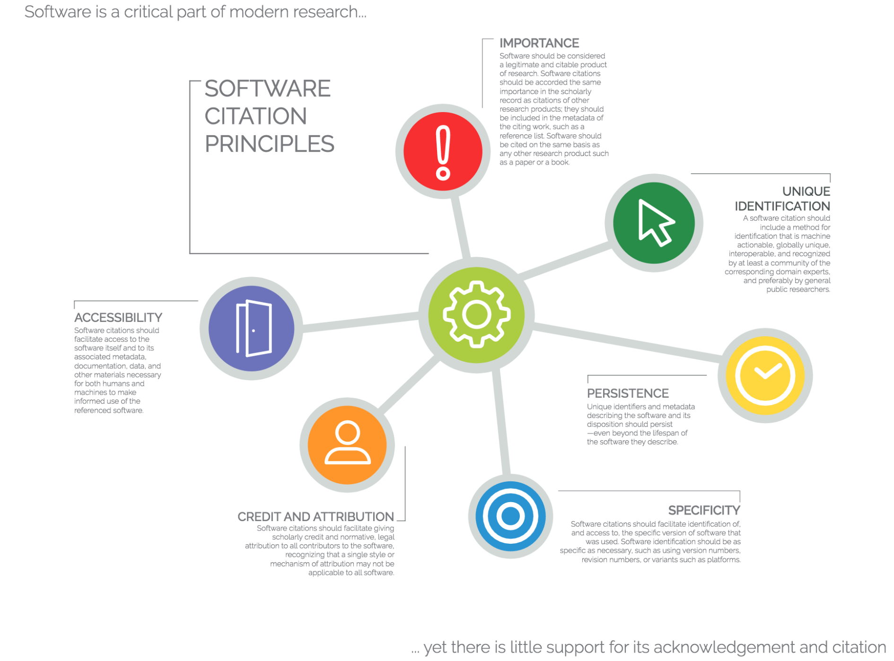

class: middle, center, title-slide
count: false

# Software Citation in HEP:  Current State and  Recommendations for the Future
.large.blue[Matthew Feickert] 
.large[(University of Wisconsin-Madison)]
 
[matthew.feickert@cern.ch](mailto:matthew.feickert@cern.ch)

[International Conference on Computing in High Energy and Nuclear Physics (CHEP) 2023](https://indico.jlab.org/event/459/contributions/11688/)

May 8th, 2023

---
# Talk Overview

.large[
* .bold[Time]: 10 minutes talk + 5 minutes questions
* .bold[Notes from organizers]:
   - Abstract: In November 2022, the HEP Software Foundation (HSF) and the Institute for Research and Innovation for Software in High-Energy Physics (IRIS-HEP) organized a workshop on the topic of "Software Citation and Recognition in HEP". The goal of the workshop was to bring together different types of stakeholders whose roles relate to software citation and the associated credit it provides, in order to engage the community in a discussion of: 1) the ways in which HEP experiments handle citation of software; 2) recognition for software efforts that enable physics results disseminated to the public; and 3) how the scholarly publishing ecosystem supports these activities. We heard from the publication board leadership of ATLAS, CMS, and LHCb in order to understand the current practice of these experiments; various open source community organizations (ROOT, Scikit-HEP, MCnet) discussed how they prefer their software to be cited; talks from publishers (Elsevier, JOSS) recognized the issue and showed an openness to following the wishes of the community; and discussions with tool providers (INSPIRE, Zenodo) covered new standards and tools for citation. The workshop made a number of tensions clear, for example between citations being used for credit and for reproducibility, and between supporting the immediate (and possibly contradictory) desires of software producers that lead to credit in today's culture and actions that might positively change the culture to better recognize the work of these developers. This talk will present highlights from the workshop as well as findings and recommendations documented in the workshop report.
]

---
# Software Citation and Recognition IRIS-HEP Workshop

.large[
* .blue[Point A] 🎉
* .red[Point B] 🌐
* .bold[Point C] 🚀
* https://indico.cern.ch/event/1211229/
]

---
# Importance of Software Citation

.large[
.kol-1-3[
* .blue[Point A] 🎉
* .red[Point B] 🌐
* .bold[Point C] 🚀
]
.kol-2-3[
.center.width-90[]
.center[[Software Citation Principles](https://support.datacite.org/docs/software-citation), Credit: Data Cite]
]
]

---
# Example Slide

.large[
* .blue[Point A] 🎉
* .red[Point B] 🌐
* .bold[Point C] 🚀
]

---
# Summary
.kol-2-3[
- .large[.bold[Important] points]
   * sub points!
   * and more
]
.kol-1-3[
 
 
 
.center.width-100[]
]

---
class: end-slide, center

Backup

---

class: end-slide, center
count: false

The end.
