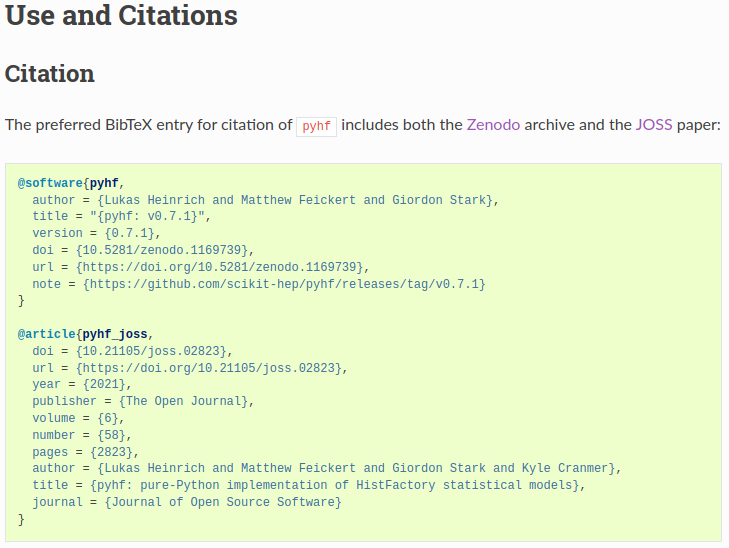
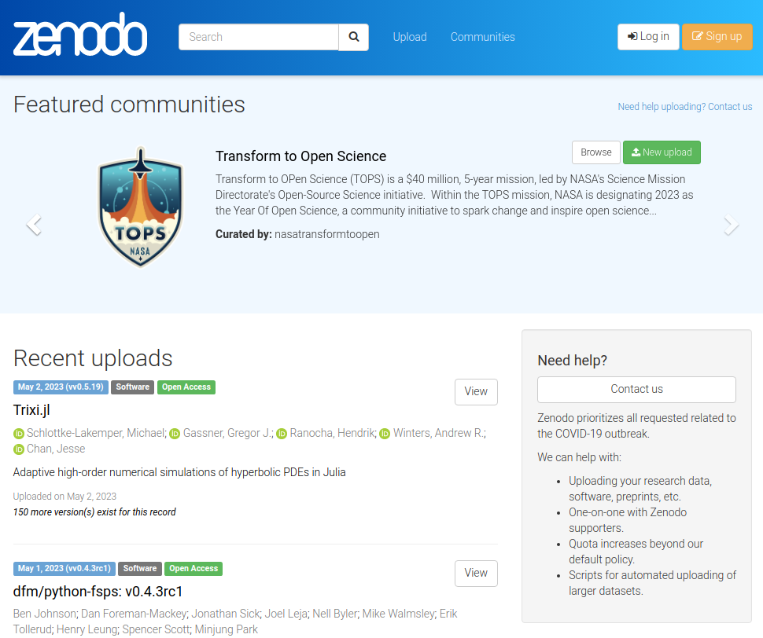
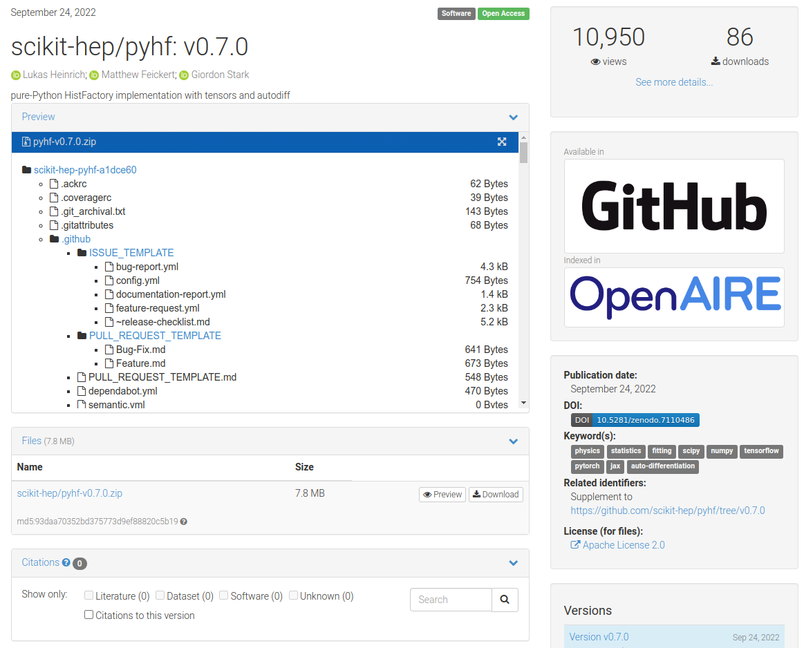

class: middle, center, title-slide
count: false

# Software Citation in HEP:<br> Current State and<br> Recommendations for the Future
.large.blue[Matthew Feickert]<br>
.large[(University of Wisconsin-Madison)]
<br>
[matthew.feickert@cern.ch](mailto:matthew.feickert@cern.ch)

[International Conference on Computing in High Energy and Nuclear Physics (CHEP) 2023](https://indico.jlab.org/event/459/contributions/11688/)

May 8th, 2023

---
# Talk Overview

.large[
* .bold[Time]: 10 minutes talk + 5 minutes questions
* .bold[Notes from organizers]:
   - Abstract: In November 2022, the HEP Software Foundation (HSF) and the Institute for Research and Innovation for Software in High-Energy Physics (IRIS-HEP) organized a workshop on the topic of "Software Citation and Recognition in HEP". The goal of the workshop was to bring together different types of stakeholders whose roles relate to software citation and the associated credit it provides, in order to engage the community in a discussion of: 1) the ways in which HEP experiments handle citation of software; 2) recognition for software efforts that enable physics results disseminated to the public; and 3) how the scholarly publishing ecosystem supports these activities. We heard from the publication board leadership of ATLAS, CMS, and LHCb in order to understand the current practice of these experiments; various open source community organizations (ROOT, Scikit-HEP, MCnet) discussed how they prefer their software to be cited; talks from publishers (Elsevier, JOSS) recognized the issue and showed an openness to following the wishes of the community; and discussions with tool providers (INSPIRE, Zenodo) covered new standards and tools for citation. The workshop made a number of tensions clear, for example between citations being used for credit and for reproducibility, and between supporting the immediate (and possibly contradictory) desires of software producers that lead to credit in today's culture and actions that might positively change the culture to better recognize the work of these developers. This talk will present highlights from the workshop as well as findings and recommendations documented in the workshop report.
]

---
# Software Citation and Recognition Workshop

.large[
* .blue[Point A] 🎉
* .red[Point B] 🌐
* .bold[Point C] 🚀
* IRIS-HEP Blueprint Process Workshop
* https://indico.cern.ch/event/1211229/
]

---
# Importance of Software Citation

.large[
.kol-1-3[
* .blue[Point A] 🎉
* .red[Point B] 🌐
* .bold[Point C] 🚀
]
.kol-2-3[
.center.width-90[[](https://support.datacite.org/docs/software-citation)]
.center[[Software Citation Principles](https://support.datacite.org/docs/software-citation), Credit: Data Cite]
]
]

---
# Current State of Software Citation

.large[
.kol-1-3[
.bold[Currently have]
* Software citation principles
* Policies from publishers
* Tooling
* Beginning of movement among developers, paper authors, journal reviewers and editors
]
.kol-2-3[
.center.width-90[[](https://support.datacite.org/docs/software-citation)]
.center[[Software Citation Principles](https://support.datacite.org/docs/software-citation), Credit: Data Cite]
]
]

---
# Current State of Software Citation in HEP: ATLAS

.huge[
.kol-1-2[
* Use a "catch-all" citation for ATLAS software tools
* For statistical analysis and ML generally cite the papers for the methods, but not the tools and software
   - Have seen some changes when the tools explicitly ask to be cited
]
.kol-1-2[
X
]
]

---
# Current State of Software Citation in HEP: CMS

.huge[
.kol-1-2[
* Endorses large CMS software projects having peer reviewed papers that would be cited in physics papers
* Have expressed positive views on additional papers being written and published
]
.kol-1-2[
X
]
]

---
# Current State of Software Citation in HEP: LHCb

.huge[
.kol-1-2[
* Following recommendations of Daniel Katz's CHEP 2018 presentation
* Most papers aim to cite all high-level software used in the analysis
   - Cite the software, and if there's a paper for the software cite that too
* Analysts are still adopting this habit and need reminding
   - Though open to idea: "We should cite software more"
]
.kol-1-2[
.center.width-55[[](https://XXXXXXXXXXXXXXXXXX)]
.center[LHCb citation template]
]
]

---
# Current State of Software Citation in HEP

.large[
* Community views and differences
]

---
# Support from Journals

.large[
* .blue[Point A] 🎉
* .bold[Recommendations from Elsevier]
   - Community needs to reach consensus on how to cite software, and share outcome with Publishers (won't take lead)
   - Publishers can better instruct editors and referees what we expect from them
* .bold[Recommendations from Journal of Open Source Software]
   - X
]

---
# Recommendations: Historical retrospective

.kol-1-2.large[
* Software in the field seeking citations would indicate this with runtime banners
* Conventions around software citation were not firmly established in the broader scientific computing community
   - Add quote from David Kirkby here
* Interrupting user logs is now recommended against given modern tooling and best practices
]
.kol-1-2.code-tiny[
```
#--------------------------------------------------------------------------
#                         FastJet release 3.4.0
#                 M. Cacciari, G.P. Salam and G. Soyez
#     A software package for jet finding and analysis at colliders
#                           http://fastjet.fr
#
# Please cite EPJC72(2012)1896 [arXiv:1111.6097] if you use this package
# for scientific work and optionally PLB641(2006)57 [hep-ph/0512210].
#
# FastJet is provided without warranty under the GNU GPL v2 or higher.
# It uses T. Chan's closest pair algorithm, S. Fortune's Voronoi code,
# CGAL and 3rd party plugin jet algorithms. See COPYING file for details.
#--------------------------------------------------------------------------
```

___

```
RooFit v3.60 -- Developed by Wouter Verkerke and David Kirkby
                Copyright (C) 2000-2013 NIKHEF, University of California & Stanford University
                All rights reserved, please read http://roofit.sourceforge.net/license.txt
```

___

```
 *------------------------------------------------------------------------------------*
 |                                                                                    |
 |  *------------------------------------------------------------------------------*  |
 |  |                                                                              |  |
 |  |                                                                              |  |
 |  |   PPP   Y   Y  TTTTT  H   H  III    A      Welcome to the Lund Monte Carlo!  |  |
 |  |   P  P   Y Y     T    H   H   I    A A     This is PYTHIA version 8.230      |  |
 |  |   PPP     Y      T    HHHHH   I   AAAAA    Last date of change:  6 Oct 2017  |  |
 |  |   P       Y      T    H   H   I   A   A                                      |  |
 |  |   P       Y      T    H   H  III  A   A    Now is 06 May 2023 at 01:12:28    |  |
 |  |                                                                              |  |
 ...
 |  |   The main program reference is 'An Introduction to PYTHIA 8.2',             |  |
 |  |   T. Sjostrand et al, Comput. Phys. Commun. 191 (2015) 159                   |  |
 |  |   [arXiv:1410.3012 [hep-ph]]                                                 |  |
 |  |                                                                              |  |
 |  |   The main physics reference is the 'PYTHIA 6.4 Physics and Manual',         |  |
 |  |   T. Sjostrand, S. Mrenna and P. Skands, JHEP05 (2006) 026 [hep-ph/0603175]  |  |
 ...
```
]

---
# Recommendations: Modern Tooling

.large[
* .blue[Point A] 🎉
* .red[Point B] 🌐
* .bold[Point C] 🚀
]

---
# Recommendations: Best Practices

.large[
* .blue[Point A] 🎉
* .red[Point B] 🌐
* .bold[Point C] 🚀
]

---
# Make clear how to cite in documentation

.kol-1-2.large[
- The easiest, but least robust way: If you have a particular citation that you want people to use, put it .bold[everywhere]
   - Version control repository README
   - Online software documentation (landing page, how to cite page)
   - Package distribution websites (e.g. PyPI)
- Having single source of truth for citations: version control repository that all other sources derive from.
- Make your citation preferences clear to the world and SEO. Do not rely on people emailing to ask (they shouldn't have to).
]
.kol-1-2[
.center.width-100[[](https://pyhf.readthedocs.io/en/stable/citations.html)]
.center[[pyhf's "Use and Citations" page in documentation](https://pyhf.readthedocs.io/en/stable/citations.html)]
]

---
# CITATION.cff

.kol-3-5.large[
- Adopt the [Citation File Format](https://citation-file-format.github.io/) as a common standard and add a `CITATION.cff` to project repository
   - Human- and machine-readable file format in YAML
   - Has well defined, versioned schema
   - Convertible to other citation formats (BibTeX, CodeMeta, EndNote, RIS, schema.org, Zenodo, APA)
- Supported by [GitHub](https://docs.github.com/en/repositories/managing-your-repositorys-settings-and-features/customizing-your-repository/about-citation-files), [Zenodo](https://twitter.com/ZENODO_ORG/status/1420357001490706442), and [Zotero](https://twitter.com/zotero/status/1420515377390530560)!
- [Web tool initializer](https://citation-file-format.github.io/cff-initializer-javascript/) for easily creating first `CITATION.cff`
- [Tooling for validation](https://github.com/citation-file-format/cff-converter-python)
.tiny[
```console
$ python -m pip install cffconvert
$ cffconvert --validate
Citation metadata are valid according to schema version 1.2.0.
```
]
]
.kol-2-5[
.tiny[
```
cff-version: 1.2.0
message: "If you use this software, please cite it as below."
authors:
  - family-names: Druskat
    given-names: Stephan
    orcid: https://orcid.org/0000-0003-4925-7248
title: "My Research Software"
version: 2.0.4
doi: 10.5281/zenodo.1234
date-released: 2021-08-11
```
]

.center[Example of minimal `CITATION.cff`]

.center.width-100[[](https://docs.github.com/en/repositories/managing-your-repositorys-settings-and-features/customizing-your-repository/about-citation-files)]
]

---
# CITATION.cff: How to keep up to date?

.large[
- As plain text, very easy to update version information when cutting a release
- Can use tool control of version update to make it easier
   - Example: [`tbump`](https://github.com/your-tools/tbump)
   - `$ tbump <version target>`
- Also possible to have [automated version bump workflows](https://github.com/scikit-hep/pyhf/blob/d9355e23ffd4aceb24041c51c697a55fa40a3d94/.github/workflows/bump-version.yml) using continuous integration
- (Jumping ahead a slide) What about the Zenodo DOI?
   - For simplicity, use the project level DOI and not the version level DOI
]

.smaller[
```yaml
cff-version: 1.2.0
message: "Please cite the following works when using this software."
type: software
...
title: "mylibrary: v1.2.3"
version: 1.2.3
doi: 10.5281/zenodo.1123456
repository-code: "https://github.com/myorg/mylibrary/releases/tag/v1.2.3"
url: "https://mylibrary.readthedocs.io/en/v1.2.3/"
```
]

---
# Zenodo

.kol-1-2[
.center.width-100[[](https://zenodo.org/)]

- Open source (but your files can be closed access)
- Versioned archival of everything: code, documents, data products, data sets
]
.kol-1-2[
.center.width-75[[](https://zenodo.org/)]
]

---
# Zenodo: DOI minting made easy

- Everything on Zenodo has a DOI
   - Provides both a .bold[project] DOI (resolves to latest) and .bold[version specific] DOI
- Enable it to [automatically preserve work from GitHub](https://guides.github.com/activities/citable-code/) (can also directly upload, but lose out on automation)
   - Benefit from having a DOI for .bold[every version] regardless of software paper landscape state
- Once you have a DOI, put it .bold[everywhere] (again)
   - Recommend sharing the project DOI and letting users select a specific version if they want it

.center[
.width-80[[](https://zenodo.org/account/settings/github/)]
]

---
# Zenodo + CITATION.cff

.center.large[CITATION.cff used by Zenodo importer to fully define Zenodo archive metadata]

.kol-1-2[
.center.width-85[[](https://github.com/scikit-hep/pyhf/blob/d9355e23ffd4aceb24041c51c697a55fa40a3d94/CITATION.cff)]
]
.kol-1-2[
.center.width-110[[](https://zenodo.org/record/7110486)]
]

---
# Zenodo: Communities allow archival collections

.kol-1-2[
.center.width-100[[](https://zenodo.org/communities/?p=PyHEP)]
]
.kol-1-2[
<br>
.center.width-100[[](https://zenodo.org/communities/atlas_experiment/)]
]

---
# Proving a citation information from APIs

.kol-2-3.large[
- In addition to providing standard formats, providing users a language API or CLI API to get the citation information for the version of the tool is helpful
   - User doesn't have to check if the information they find online matches their version.
- Historically, this was done by printing a banner with citation or copyright information when the library is used
   - This should .bold[not] be done now. This creates noise for users and if multiple tools did this your terminal would get filled.
   - Most libraries that used to do this have now abandoned this approach.
- Opinion: There are tools in broader scientific ecosystem that provide citation information for their dependencies as well. While very conscientious, I think this is .bold[unnecessary] and can be confusing to users.
]
.kol-1-3[
<br><br>
```console
# CLI API
$ mytool --citation
$ mytool --cite
```
```python
# Python API
import mytool
mytool.utils.citation()
```
.center.large[Example APIs]
]


---
# Outlook

.large[
* .blue[Point A] 🎉
* .red[Point B] 🌐
* .bold[Point C] 🚀
]

---
# Example Slide

.large[
* .blue[Point A] 🎉
* .red[Point B] 🌐
* .bold[Point C] 🚀
]

---
# Summary

.kol-2-3[
- .large[.bold[Important] points]
   * sub points!
   * and more
   * Workshop report coming to arXiv soon
]
.kol-1-3[
<br>
<br>
<br>
.center.width-100[[](https://iris-hep.org/)]
]

---
class: end-slide, center

Backup


---

class: end-slide, center
count: false

The end.
